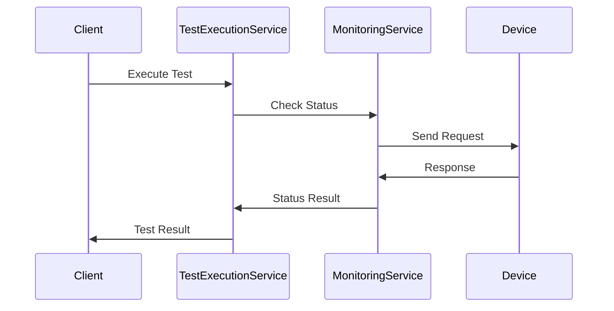

# Heart Beat Service Architecture

## System Overview

The Heart Beat service is designed with a modular architecture that supports both MQTT and HTTP device monitoring. The system is built on Laravel and follows SOLID principles and clean architecture patterns.

## Core Components

### 1. Test Execution Service
- **Purpose**: Orchestrates test scenarios and flow execution
- **Key Features**:
  - Flow type determination
  - Test execution coordination
  - Result management
  - Error handling

### 2. Monitoring Service
- **Purpose**: Handles device communication
- **Features**:
  - MQTT status checking
  - HTTP status checking
  - Response time tracking
  - Protocol-specific handling

### 3. Device Management
- **Purpose**: Manages device configurations
- **Features**:
  - Device registration
  - Protocol configuration
  - Credentials management

### 4. Test Scenarios
- **Purpose**: Defines test cases
- **Features**:
  - Flow configuration
  - Device association
  - Test parameters

## Data Flow



## Database Schema

### Key Tables

1. **test_scenarios**
   - id
   - name
   - description
   - flow_type
   - created_at
   - updated_at

2. **devices**
   - id
   - name
   - protocol (mqtt/http)
   - configuration
   - created_at
   - updated_at

3. **device_monitoring_results**
   - id
   - device_id
   - test_scenario_id
   - success
   - error_message
   - response_time_ms
   - metadata
   - created_at
   - updated_at

## Service Layer

### TestExecutionService
- Flow determination
- Test execution
- Result management
- Error handling

### MonitoringService
- Protocol handling
- Device communication
- Status checking
- Response processing

## Error Handling

The system implements a comprehensive error handling strategy:

1. **Exception Hierarchy**
   - DeviceException
   - MonitoringException
   - TestExecutionException

2. **Logging**
   - Structured logging
   - Error context
   - Stack traces
   - Performance metrics

3. **Recovery Mechanisms**
   - Retry logic
   - Fallback strategies
   - Graceful degradation

## Security

1. **Authentication**
   - API authentication
   - Device credentials
   - Service authentication

2. **Data Protection**
   - Encrypted communication
   - Secure credential storage
   - Data validation

## Monitoring and Metrics

1. **Performance Monitoring**
   - Response times
   - Success rates
   - Error rates

2. **System Health**
   - Service status
   - Resource utilization
   - Queue status

## Configuration Management

The service uses Laravel's configuration system with environment-specific settings:

```env
# MQTT Configuration
MQTT_HOST=mqtt.example.com
MQTT_PORT=1883
MQTT_USERNAME=username
MQTT_PASSWORD=password

# HTTP Configuration
HTTP_ENDPOINT=https://api.example.com
HTTP_TIMEOUT=30
HTTP_RETRY_ATTEMPTS=3

# Monitoring Configuration
MONITORING_LOG_CHANNEL=monitoring
MONITORING_RETENTION_DAYS=30
```

## Deployment

The service supports various deployment strategies:

1. **Container-based**
   - Docker support
   - Kubernetes compatibility
   - Scalable architecture

2. **Traditional**
   - PHP-FPM
   - Apache/Nginx
   - Queue workers

## Future Considerations

1. **Scalability**
   - Horizontal scaling
   - Load balancing
   - Cache optimization

2. **Features**
   - Additional protocols
   - Advanced analytics
   - Real-time monitoring
