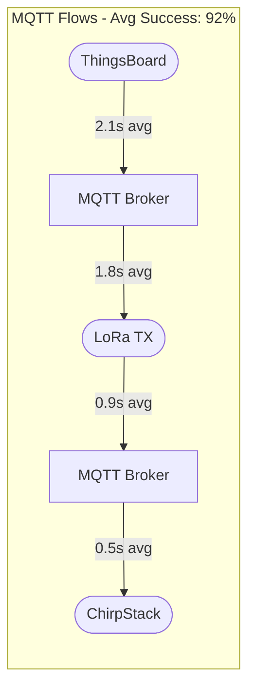

# Test Scenario Dashboard

## Test Scenario Overview

### MQTT Test Flows
- **Flow 1**: JSON → LPP (Downlink) [🟢 Healthy]
  - Path: ThingsBoard → MQTT Broker → LoraTX → MQTT Broker → ChirpStack
  - Last Run: 2m ago | Success Rate: 99% | Messages: 532

- **Flow 2**: LPP → JSON (Uplink) [🟡 Warning]
  - Path: ChirpStack → MQTT Broker → LoraRX → MQTT Broker → ThingsBoard
  - Last Run: 5m ago | Success Rate: 85% | Messages: 231
  - Warning: High latency in LoraRX (2.3s)

- **Flow 3**: Two-Way Route [🔴 Error]
  - Path: TB ↔ MQTT Broker ↔ Lora ↔ MQTT Broker ↔ CS
  - Last Run: 15m ago | Success Rate: 0% | Messages: 0
  - Error: MQTT Broker offline

## Service Flow Visualization

The service detail page features two main communication flows displayed in a clear, interactive visualization. The complete flow diagrams can be found in [Test Scenario Flows](diagrams/test-scenario-flows.md).

### Interactive Features

- **Clickable Services**: Each service box is clickable and will open a detailed view showing:
  - Current service status (🟢 Healthy, 🟡 Warning, 🔴 Error)
  - Service metrics (uptime, response time, error rate)
  - Recent logs and events
  - Configuration details

- **Animated Arrows**: 
  - Pulsing animation shows active message flow
  - Arrow color indicates status:
    - Green: Normal flow
    - Yellow: Delayed/degraded
    - Red: Failed/blocked
  - Hover shows message count and last message timestamp

- **Real-time Updates**:
  - Service status updates in real-time
  - Flow animations reflect actual message movement
  - Metrics refresh every 30 seconds

### Service Status Overview

| Service | Status | Uptime | Response Time | Messages (24h) |
|---------|--------|--------|---------------|---------------|
| ChirpStack | 🟢 Healthy | 99.9% | 45ms | 12,453 |
| MQTT Broker | 🟢 Healthy | 99.99% | 12ms | 24,906 |
| LoRa RX | 🟢 Healthy | 99.8% | 78ms | 12,453 |
| LoRa TX | 🟢 Healthy | 99.8% | 82ms | 12,453 |
| ThingsBoard | 🟢 Healthy | 99.95% | 156ms | 24,906 |

## Service Detail View

### Service Performance by Flow Type

### Service Metrics Summary
| Flow Type | Services Involved | Avg Response Time | Success Rate | Total Messages |
|-----------|------------------|-------------------|--------------|----------------|
| MQTT      | 5 services       | 5.3s             | 92%          | 763           |

### Service Health Indicators
- 🟢 ThingsBoard: 99.95% uptime, 156ms avg response
- 🟢 ChirpStack: 99.9% uptime, 45ms avg response
- 🟢 MQTT Brokers: 99.99% uptime, 12ms avg response
- 🟢 LoRa Services: 99.8% uptime, 80ms avg response

## Flow Details Modal
┌─Flow 2: LPP → JSON (CS → MQTT Broker → LoraRX → MQTT Broker → TB)─────────────────────────┐
│ Current Status: 🟡 Warning - High Latency                                    │
│                                                                             │
│ Service Chain:                                                              │
│ ChirpStack → MQTT Broker → LoRa RX → MQTT Broker → ThingsBoard             │
│ [🟢 Healthy] [🟢 Healthy]    [🟡 Warning]  [🟢 Healthy]   [🟢 Healthy]            │
│                                                                             │
│ Performance Metrics:                                                        │
│ - Total Flow Time: 3.2s                                                     │
│ - Success Rate (24h): 85%                                                   │
│ - Message Count: 231                                                        │
│                                                                             │
│ Service Response Times:                                                     │
│ ChirpStack  : 185ms                                                         │
│ MQTT Broker : 205ms                                                         │
│ LoRa RX     : 2.4s (Above threshold: 1.0s)                                 │
│ MQTT Broker : 198ms                                                         │
│ ThingsBoard : 212ms                                                         │
│                                                                             │
│ Recent Messages:                                                            │
│ 15:32:45 - Success - Total: 3.1s (CS:180ms, MQTT:195ms, RX:2.3s, ...)     │
│ 15:30:30 - Success - Total: 3.3s (CS:190ms, MQTT:200ms, RX:2.5s, ...)     │
│ 15:28:15 - Success - Total: 3.2s (CS:185ms, MQTT:205ms, RX:2.4s, ...)     │
│ [Show More...]                                                              │
│                                                                             │
│                                                   [Export] [Close] [Refresh] │
└─────────────────────────────────────────────────────────────────────────────┘

## Interaction Details

### Time Range Selector (when clicking [Custom])
┌─Select Time Range──────────────────────┐
│ From: [2024-01-20 00:00] │
│ To:   [2024-01-20 23:59] │
│                                        │
│ Quick Select:                          │
│ [Last Hour] [Last 24h] [Last 7 Days]   │
│                                        │
│              [Apply] [Cancel]          │
└────────────────────────────────────────┘

## Notes:
1. All metrics are real-time updated
2. Graphs are interactive (hover for details)
3. Status indicators:
   - 🟢 Healthy
   - 🟡 Warning
   - 🔴 Error
4. Each section is collapsible
5. All data tables are sortable
6. Export options available for all data
